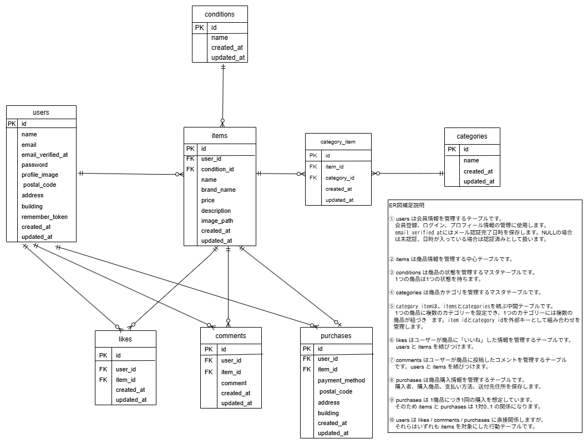

# アプリケーション名

新規模擬案件\_フリマアプリ

## 概要

フリマアプリを想定したLaravelアプリケーションです。

ユーザーは会員登録・ログインを行い、商品一覧や商品詳細を閲覧できます。  
ログイン後は、商品の出品、購入、いいね、コメント投稿、プロフィール設定・編集などを行えます。

未ログイン状態でも商品一覧・商品詳細の閲覧はできますが、いいね、コメント、購入、出品、プロフィール関連機能はログイン後に利用する仕様です。

## 実装機能

- 会員登録機能
- ログイン機能
- ログアウト機能
- メール認証機能
- プロフィール設定機能
- プロフィール編集機能
- 商品一覧表示機能
- 商品検索機能
- マイリスト表示機能
- 商品詳細表示機能
- いいね機能
- コメント投稿機能
- 商品購入機能
- 支払い方法選択機能
- 送付先住所変更機能
- 購入済み商品表示機能
- 商品出品機能
- 商品画像アップロード機能

## 環境構築

### 1. リポジトリからダウンロード

```bash
git clone git@github.com:Mussy649/masuda-kadai2.git
```

```bash
cd masuda-kadai2
```

### 2. Dockerコンテナを構築・起動

```bash
docker compose up -d --build
```

※環境によっては以下のコマンドを使用してください。

```bash
docker-compose up -d --build
```

### 3. phpコンテナにログイン

```bash
docker compose exec php bash
```

※環境によっては以下のコマンドを使用してください。

```bash
docker-compose exec php bash
```

### 4. Composer依存パッケージをインストール

```bash
composer install
```

### 5. 「.env.example」をコピーして「.env」を作成

```bash
cp .env.example .env
```

### 6. `.env`ファイルのDB・メール設定を変更

`.env` ファイル内の該当箇所を以下のように変更します。

```env
DB_CONNECTION=mysql
DB_HOST=mysql
DB_PORT=3306
DB_DATABASE=laravel_db
DB_USERNAME=laravel_user
DB_PASSWORD=laravel_pass

MAIL_MAILER=smtp
MAIL_HOST=mailhog
MAIL_PORT=1025
MAIL_USERNAME=null
MAIL_PASSWORD=null
MAIL_ENCRYPTION=null
MAIL_FROM_ADDRESS=noreply@coachtech.local
MAIL_FROM_NAME="${APP_NAME}"
```

### 7. アプリケーションキーを作成

```bash
php artisan key:generate
```

### 8. DBのテーブルを作成

```bash
php artisan migrate
```

### 9. DBのテーブルに初期データを投入

```bash
php artisan db:seed
```

### 10. ストレージリンクを作成

```bash
php artisan storage:link
```

### 11. キャッシュをクリア

```bash
php artisan optimize:clear
```

### 12. MailHogを使用したメール認証

MailHogの受信画面をブラウザで開きます。

```text
http://localhost:8025
```

メール認証の確認手順は以下のとおりです。

1. 会員登録画面から新しいユーザーを登録する
2. メール認証誘導画面が表示される
3. MailHogの受信画面を開く
4. 届いた「Verify Email Address」のメールを開く
5. メール内の認証リンクをクリックする
6. 認証完了後、プロフィール設定画面へ遷移する
7. プロフィールを登録すると商品一覧画面へ遷移する

メール認証誘導画面の「認証メールを再送する」をクリックすると、認証メールを再送できます。

未認証のまま再度ログインした場合は、通常画面へは進まず、メール認証誘導画面へ遷移します。

## 使用技術

- PHP 8.1
- Laravel 8.x
- Laravel Fortify
- MySQL 8.0
- nginx
- Docker / Docker Compose
- phpMyAdmin
- MailHog

## URL

- 商品一覧画面：http://localhost/
- 会員登録画面：http://localhost/register
- ログイン画面：http://localhost/login
- プロフィール画面：http://localhost/mypage
- 商品出品画面：http://localhost/sell
- メール認証誘導画面：http://localhost/email/verify
- MailHog：http://localhost:8025
- phpMyAdmin：http://localhost:8080

## ER図



## 補足

本アプリは、フリーマーケットアプリの要件定義書およびFigmaの画面仕様に基づいて実装しています。

出品時にアップロードされた商品画像およびプロフィール画像は、Laravelの`storage`ディレクトリへ保存し、データベースには画像の保存パスを登録しています。画像を表示するため、環境構築時に以下のコマンドを実行してください。

```bash
php artisan storage:link
```

データベースは、主に以下の8テーブルで構成されています。

```text
users
items
categories
category_item
conditions
likes
comments
purchases
```

`items`と`categories`は多対多の関係となっており、中間テーブルの`category_item`を使用して、1つの商品に複数のカテゴリーを設定しています。

商品購入時には、購入画面で選択した配送先情報を`purchases`テーブルへ保存します。購入後にユーザーのプロフィール住所を変更しても、購入時点の配送先情報は変更されません。

メール認証にはMailHogを使用しています。新規会員登録後、MailHogに届いた認証メール内のリンクからメール認証を完了してください。未認証のユーザーは、通常のアプリ機能を利用できません。

決済機能にはStripeのテスト環境を使用しているため、実際の決済は発生しません。
